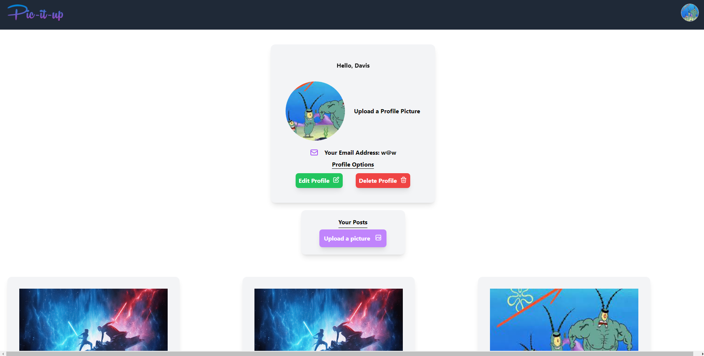

# Pic it Up

Welcome to Pic it Up, where users can post their favorite pictures, comment on them and view other user's photos.
Login and update your profile any time.
Happy scrolling

## Installation

- Fork and clone this repository
- you will need a .env for your JWT_SECRET, CLOUDINARY_URL and CLOUD_USER_ID file on the server side.
- you will need a .env.local for your REACT_APP_SERVER_UR on your client side
- this app uses mongodb for the db
- you will need to use nodemon to consistently restart your app
- npm i to install dependencies

## Wireframe/ERD

## REST Routes

## User Stories

- As a user, I want to be able to log in
- As a user, I want to be able to register
- As a user, I want to be able to log out
- As a user, I want to be able to upload images on my profile
- As a user, I want to be able to able to see other user's images
- As a user, I want to be able to submit a comment
- As a user, I want to be able to delete comments
- As a user, I want to be able to edit comments/ and profile

## MVP Goals

- Be able to post a picture on profile page
- Be able to to click other user's page
- Be able to leave comments on a user's picture
- Be able to delete/edit/submit a post/or comment
- Be able to update profile

## Stretch Goal

- Be able to like/dislike a picture
- Have a community post

## Technologies Used

This app was built using mongodb, express, react and node.js.
The styling was done using tailwind.

## Aproach

We began by planning out the routes and setting up a client side and server side. Next we mob coded the backend. We split up the front end and implemented changes and fixed bugs little by little. Finally we tackled the styling using tailwind.

## Hurdles

There were sometimes that fixing one piece of the site would break another. Working together to smoothe out all the wrinkles was a challenge, especially towards the end. The final product was well worth the struggle.

# Pic it Up

Welcome to Pic it Up, where users can post their favorite pictures, comment on them and view other user's photos.
Login and update your profile any time.
Happy scrolling

## Installation

- Fork and clone this repository
- you will need a .env for your JWT_SECRET, CLOUDINARY_URL and CLOUD_USER_ID file on the server side.
- you will need a .env.local for your REACT_APP_SERVER_UR on your client side
- this app uses mongodb for the db
- you will need to use nodemon to consistently restart your app
- npm i to install dependencies

## Wireframe/ERD

## REST Routes

## User Stories

- As a user, I want to be able to log in
- As a user, I want to be able to register
- As a user, I want to be able to log out
- As a user, I want to be able to upload images on my profile
- As a user, I want to be able to able to see other user's images
- As a user, I want to be able to submit a comment
- As a user, I want to be able to delete comments
- As a user, I want to be able to edit comments/ and profile

## MVP Goals

- Be able to post a picture on profile page
- Be able to to click other user's page
- Be able to leave comments on a user's picture
- Be able to delete/edit/submit a post/or comment
- Be able to update profile

## Stretch Goal

- Be able to like/dislike a picture
- Have a community post

## Technologies Used

- This app was built using mongodb, express, react and node.js.
- The styling was done using tailwind.

## Aproach

- We began by planning out the routes and setting up a client side and server side. Next we mob coded the backend. We split up the front end and implemented changes and fixed bugs little by little. Finally we tackled the styling using tailwind.

## Hurdles

- There were sometimes that fixing one piece of the site would break another. Working together to smoothe out all the wrinkles was a challenge, especially towards the end. The final product was well worth the struggle.
