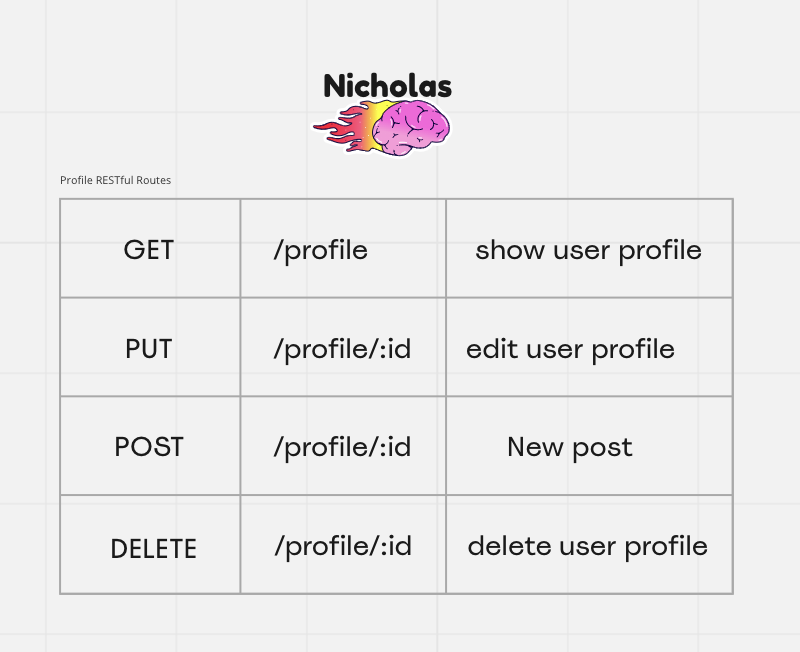
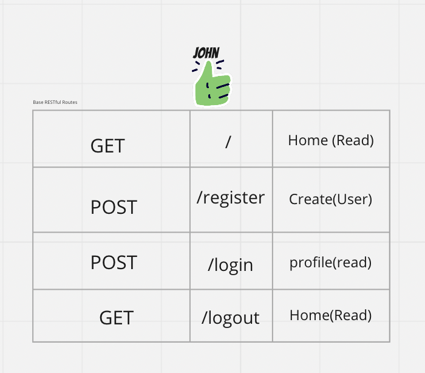

## Pic-It-Up

- Pic-It-Up is a website where a user can post whatever picture they desire, and have other users be able to view certain picture's made by them, and be able to leave a comment on it if they like it.

## Wireframe/ERD

## REST Routes

## User Stories

- As a user, I want to be able to log in
- As a user, I want to be able to register
- As a user, I want to be able to log out
- As a user, I want to be able to upload images on my profile
- As a user, I want to be able to able to see other user's images
- As a user, I want to be able to submit a comment
- As a user, I want to be able to delete comments
- As a user, I want to be able to edit comments/ and profile

## MVP Goals

- Be able to post a picture on profile page
- Be able to to click other user's page
- Be able to leave comments on a user's picture
- Be able to delete/edit/submit a post/or comment
- Be able to update profile

## Stretch Goal

- Be able to like/dislike a picture
- Have a community post

=======

